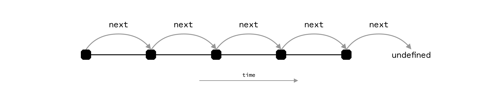

# next

_Returns the next revision of a given revision if it exists._

## Type

```ts
next(rev: string): Promise<string | undefined>
```

### Parameters

#### `rev`

A revision encoded as a string of the form `<transaction-id>:<output-number>`.

### Return Value

The next revision or undefined.

## Description

Given the revision of an on-chain object, the function returns the next revision of the same on-chain object. If no such revision exists because the revision passed in is a latest revision, `undefined` is returned.

### Inside smart contracts (`InnerComputer`)

When called via the global `computer` **inside** a `Contract` method, behavior is stricter than the outer client API:

- Absence of a next revision **invalidates** the entire evaluation (no stable `undefined` success).
- Both the starting revision and the returned successor must refer to **confirmed** transactions; a mempool-only next invalidates.
- Prefer [`prev`](./prev.md) / ancestors for exploratory walks. See [Contract – Querying](../Contract/index.md#querying-inside-of-a-contract).

[](https://wallet.bitcoincomputer.io)

## Example

:::code source="../../../lib/test/lib/computer/next.test.ts" :::

<a href="https://github.com/bitcoin-computer/monorepo/blob/main/packages/lib/test/lib/computer/next.test.ts" target=_blank>Source</a>
