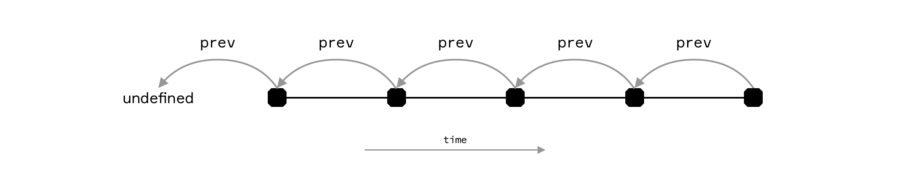

# prev

_Returns the previous revision of a given revision if it exists._

## Type

```ts
prev(rev: string): Promise<string | undefined>
```

### Parameters

#### `rev`

A revision encoded as a string of the form `<transaction-id>:<output-number>`.

### Return Value

The previous revision or undefined.

## Description

Given the revision of an on-chain object, the function returns the previous revision of the same on-chain object. If no such revision exists because the revision passed in is the revision where the on-chain object was created, `undefined` is returned.

### Inside smart contracts (`InnerComputer`)

- The starting revision must be **confirmed**.
- `undefined` at a confirmed root is a **stable** result and does **not** invalidate the evaluation (unlike `next` at the tip).
- See [Contract – Querying](../Contract/index.md#querying-inside-of-a-contract).

[](https://wallet.bitcoincomputer.io)

## Example

:::code source="../../../lib/test/lib/computer/prev.test.ts" :::

<a href="https://github.com/bitcoin-computer/monorepo/blob/main/packages/lib/test/lib/computer/prev.test.ts" target=_blank>Source</a>
