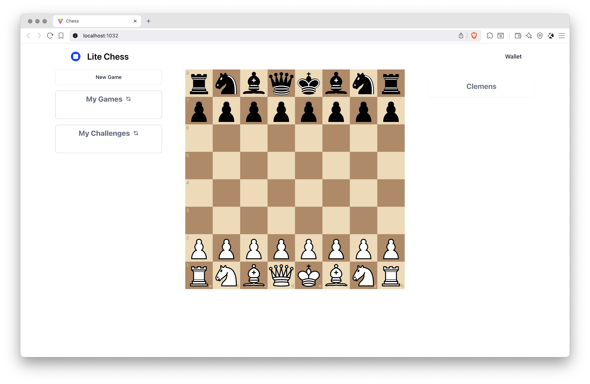

<div align="center">
  
  <h1>Bitcoin Computer Chess</h1>
  <p>
    An App for Wagering on Chess
    <br />
    <a href="http://bitcoincomputer.io/">website</a> &#183; <a href="http://docs.bitcoincomputer.io/">docs</a>
  </p>
</div>

This app allows two users to wager on a game of chess. There are no middlemen, the wagers are held in a 2-of-2 multisig address between the players.

> [!NOTE]
> The current version requires that the winner trusts that the looser to help to retrieve the winnings, otherwise the wagers remain locked.

This is a work in progress and not recommended for production use. A future version will be completely trustless, governed by a smart contract.

## Installation

Follow the instructions below to install the [Bitcoin Computer Monorepo](https://github.com/bitcoin-computer/monorepo).

<font size=1>

```sh
# Download the monorepo
git clone https://github.com/bitcoin-computer/monorepo.git

# Move into monorepo folder
cd monorepo

# Install the dependencies of the monorepo
npm install

# Move to the NFT package folder
cd packages/nft
```

</font>

## Usage

Start a Bitcoin Computer Node in the package `node`. Then copy the `.env.example` file.

<font size=1>

```sh
cp .env.example .env
```

</font>

Deploy the smart contracts in the package `chess-contracts`.

<font size=1>

```sh
cd ../chess-contracts
cp .env.example .env
npm run deploy
cd ../chess-app
```

</font>

Start the App

<font size=1>

```sh
npm start
```

</font>

### Test

<font size=1>

```sh
npm test
```

</font>

### Start the App

<font size=1>

```sh
npm start
```

</font>

## License

This software is licensed under the MIT License. See the [LICENSE.md](./LICENSE.md) file.

This software includes patented technology that requires payment for use on mainnet or production environments. Please review the [LEGAL.md](./LEGAL.md) file for details on patent usage and payment requirements.
