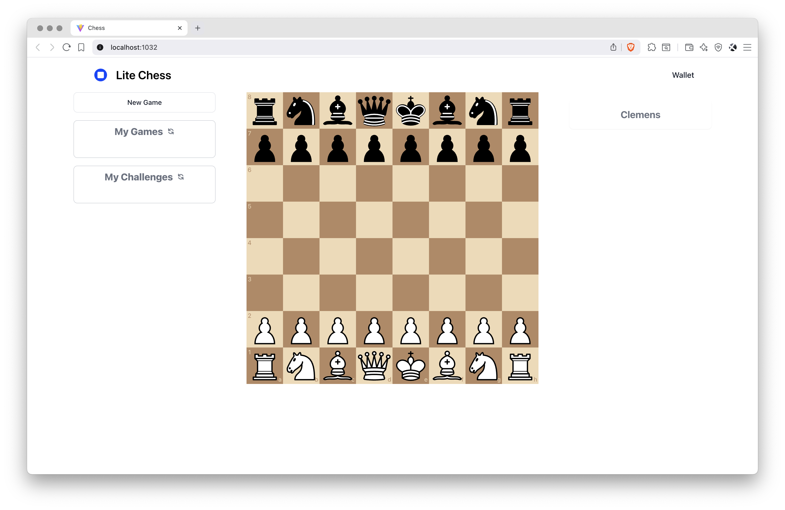

<div align="center">
  <h1>Bitcoin Computer Chess</h1>
  <p>
    A React front-end for playing on-chain chess with TBC777 token wagers on Bitcoin
Computer.
    <br />
    <a href="http://bitcoincomputer.io/">website</a> &#183; <a href="http://docs.bitcoincomputer.io/">docs</a>
  </p>
</div>

Two players lock equal amounts of a TBC777 token into a non-custodial
`ChessContract` escrow. The board state (FEN + SAN move list) lives on-chain and
is validated by chess.js running inside the deployed module. When the game
ends—by checkmate, draw, or resignation—the contract authorizes the correct
payouts. The winner (or both players on a draw) claims independently; the losing
player never needs to sign or stay online.

This package is optional open-source front-end software. The underlying
`ChessContract` and TBC777 escrow logic remain fully accessible without this app
via the open `@bitcoin-computer` libraries together with a local node, direct
transaction construction, or any alternative renderer.

The app provides a convenient user experience for those who choose to use it:
log in with a wallet, create or accept challenges, play on a live reactive
board, resign or cancel, view token balances, claim test tokens from a faucet,
and withdraw winnings.

<p align="center">
  
</p>

## Important Legal & Risk Notice

This package provides open-source front-end software for interacting with
on-chain chess contracts that use TBC777 token escrows. BCDB Inc. does not
operate, host, match, or facilitate any games, contests, or wagers. All activity
occurs peer-to-peer on public UTXO blockchains through self-executing contracts.

**Use at your own risk.** Digital-asset smart contracts are experimental. You
can lose the entire wagered amount through user error, contract bugs, network
conditions, or regulatory action. You are solely responsible for compliance with
all applicable laws, including skill-contest / gaming, money-transmission,
sanctions, AML, securities (Howey), and the California Digital Financial Asset
Law (DFAL).

The contracts are spot-only and skill-based. BCDB Inc. provides no custody, no
matching engine, no guarantees of outcome, and no investment advice.

**The complete patent notice, licensing terms, disclaimers, limitation of
liability, and risk allocation appear in [LEGAL.md](./LEGAL.md).** That file is
the authoritative source. Review it before any mainnet or production use. This
software is provided “AS IS.”

## What You Can Do

- **Create a challenge** – Choose a wager amount and the opponent’s public key.
  The app creates the on-chain game, deposits your tokens as White, and posts a
  lightweight on-chain challenge object that the invited opponent can locate.
- **Accept a challenge** – Locate the invitation in your Challenges list,
  deposit the matching amount, and the game becomes live (ownership moves to the
  first player).
- **Play** – Moves are submitted on-chain. The board stays in sync via
  subscriptions; only the player to move can act.
- **Resign or cancel** – Resign awards the pot to the opponent. A one-sided
  (pending) challenge can be cancelled by its creator with a full refund.
- **Claim winnings** – After a terminal position the contract has already
  written the authorization. Use the Withdraw button (or call the token helper)
  — no co-signature required.
- **Manage tokens** – View balances, claim test tokens from the faucet, and see
  which tokens are available for wagers.
- **Create a user profile** – Optional on-chain profile that records the games
  you have played.

## How It Works

1. **Create** – A player opens the New Game modal, selects a token with
   sufficient balance, sets the wager (and optional time limit), and supplies
   the opponent’s public key. The app creates a `ChessContract`, deposits the
   wager, registers the game on the user’s profile, and emits a
   `ChessChallengeTxWrapper`.
2. **Accept** – The challenged player locates the invitation in their Challenges
   list, deposits the matching amount, and the game becomes live (owned by
   White).
3. **Play** – Each move calls `ChessContractHelper.move()`. The contract updates
   FEN and the SAN list. On a terminal position it immediately writes the
   appropriate `withdraws` entries.
4. **Resign / Cancel** – The player to move may resign. Pending (one-deposit)
   games can be cancelled only by the creator; the single deposit is refunded
   through the same `withdraws` mechanism.
5. **Claim** – Entitled players call `token.withdraw(chessRev)` (exposed in the
   UI). Because TBC777’s `EscrowAuditor` walks the full revision history of the
   escrow, the loser never needs to cooperate.

Clocks are derived from the revision history of the contract (block times of
successive states) using the Inner Computer. Timeouts are currently
informational only—they are not enforced by the contract itself.

## Key Features

- Live reactive chessboard powered by `react-chessboard` and on-chain
  subscriptions
- Challenge and games lists with infinite scroll
- Wallet login and authentication via `@bitcoin-computer/components`
- Token balance view and simple faucet for test tokens
- Fully on-chain rules and state (chess.js inside the deployed module)
- Atomic settlement: the winning move itself authorizes the payout
- Independent claims – loser cooperation is never required
- Creator can cancel a one-sided challenge and reclaim the deposit
- Compatible with TBC777 token lineages (the app is oriented around a configured
  token + faucet for convenience)
- Built with React, Vite, Tailwind CSS and Flowbite
- Configurable to any compatible Bitcoin Computer node (including a fully local
  node)

## Installation

```sh
git clone https://github.com/bitcoin-computer/monorepo.git
cd monorepo
npm install
```

## Usage

1. **Start a Bitcoin Computer node** (see the `node` package) so the front-end
   has a REST endpoint to talk to. For production or compliance isolation you
   should run (or point at) your own node.

2. **Deploy the required modules** from the companion package:

```sh
cd packages/chess-contracts
cp .env.example .env
npm run deploy
```

The deploy script deploys the chess game module, user module, challenge wrapper
and a TBC777 token. It will offer to write the resulting module IDs into
`packages/chess-app/.env`.

3. **Configure the front-end** (if the deploy step did not already update the
   file):

```sh
cd ../chess-app
cp .env.example .env
```

Typical variables:

```
VITE_CHAIN=LTC
VITE_NETWORK=regtest
VITE_URL=http://127.0.0.1:1031
VITE_PATH=m/44'/1'/0'
VITE_PORT=1032
VITE_CHESS_GAME_MOD_SPEC=...
VITE_CHESS_USER_MOD_SPEC=...
VITE_CHESS_CHALLENGE_MOD_SPEC=...
VITE_TBC20_MOD_SPEC=...
VITE_MINTER_MNEMONIC=...
VITE_CHESS_TOKEN_ID=...
```

`VITE_URL` can be set to any compatible node endpoint (local or remote). When
you supply your own gateway, reference-layer compliance controls that apply to
hosted infrastructure no longer apply.

4. **Launch the development server**:

```sh
npm start
# or
npm run dev
```

The app is available at the URL printed by Vite (usually
`http://localhost:5173`).

### Scripts

```bash
npm start / npm run dev   # development server
npm run build:prod        # production build
npm run types             # TypeScript check
npm run lint              # ESLint
```

Unit and integration tests for the on-chain logic live primarily in
`packages/chess-contracts`. The front-end relies on those contracts plus the
shared component library.

## Architecture

| Layer          | Package / Component                 | Responsibility                                              |
| -------------- | ----------------------------------- | ----------------------------------------------------------- |
| UI             | `chess-app` (this package)          | Board, challenge/games lists, wallet, balances, routing     |
| Shared UI      | `@bitcoin-computer/components`      | Auth, LoginModal, Wallet, ComputerContext, utilities        |
| Game logic     | `@bitcoin-computer/chess-contracts` | `ChessContract`, helpers, challenge wrapper, User profile   |
| Token & escrow | `@bitcoin-computer/TBC777`          | Deposit / withdraw, supply-invariant `EscrowAuditor`        |
| Runtime        | `@bitcoin-computer/lib`             | Evaluation, persistence, wallet, REST client, subscriptions |

The front-end never holds the opponent’s private keys and never acts as a
custodian. All value movements are executed by the players themselves through
the smart-contract helpers. The app is purely a client; it does not match
players, hold funds, or operate any contest.

Main routes:

- `/` – Home (challenges, games, new-game entry point)
- `/game/:id` – Live board for a specific game
- `/tokens` – Token balances and faucet

## Documentation

- [Bitcoin Computer documentation](https://docs.bitcoincomputer.io/)
- [Chess Contracts](../chess-contracts) – on-chain game + escrow logic
- [TBC777 – programmable escrow token standard](../TBC777)
- Source: [`src/`](./src/) (especially `components/ChessBoard.tsx`,
  `NewGame.tsx`, `Home.tsx`, `ChallengesList.tsx`, `GamesList.tsx`,
  `TokenBalance.tsx`)

## Getting Help

Telegram: [t.me/thebitcoincomputer](https://t.me/thebitcoincomputer)  
Twitter: [@TheBitcoinToken](https://twitter.com/TheBitcoinToken)  
Email: clemens@bitcoincomputer.io

## License

MIT License — see [LICENSE.md](./LICENSE.md).

This software includes patented technology (U.S. Patent Nos. 11,188,911 and
11,694,197 and family). The patented technology is currently available under
open terms; mainnet / production use is subject to the technical-dust +
hygiene-service model and the terms in [LEGAL.md](./LEGAL.md). Transactions
created before 2026-06-15 are grandfathered. Contact clemens@bitcoincomputer.io
for alternative licensing.
