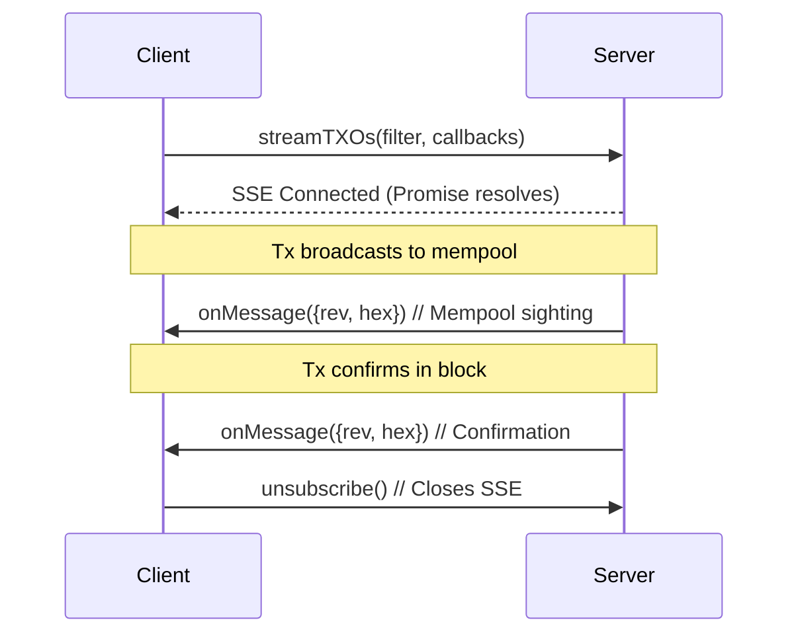

# streamTXOs

_Subscribe to real-time transaction updates matching your filter. Get notified twice per match: once on mempool entry, again on block confirmation. Powered by SSE for low-latency streaming._



## Type

```ts
type StreamQuery = {
  satoshis?: bigint
  asm?: string
  exp?: string
  mod?: string
}

streamTXOs(
  filter: Partial<StreamQuery>,
  onMessage: ({ rev, hex }: { rev: string; hex: string }) => void,
  onError?: (error: Event) => void,
): Promise<() => void>
```

### Parameters

#### `filter`

A partial `StreamQuery` object that defines the properties a transaction output must satisfy. The supported properties are:

| Property   | Type      | Description |
|------------|-----------|-------------|
| `satoshis` | `bigint?` | The number of satoshis on the output. |
| `asm`      | `string?` | The script assembly (ASM) of the output. |
| `exp`      | `string?` | The expression for the output's transaction. |
| `mod`      | `string?` | The module specifier for the output. |

Any combination of the supported fields (e.g., `mod`, `satoshis`, `asm`) can be used. All provided fields are combined with AND logic.

Note that if a transaction has multiple outputs that encode objects you will receive updates for each of these outputs when subscribing to `exp`. This is because the expression `exp` is a property of the transaction, not of the output.

#### `onMessage`

The function to call when a matching transaction is detected. The callback receives an object containing:
- `rev`: the revision of matching output, that is `<transaction id>:<output number>`
- `hex`: the transaction hex

#### `onError` (optional)

A callback invoked when an error occurs on the SSE connection, such as network interruptions or parsing failures. It receives a standard browser [`Event`](https://developer.mozilla.org/en-US/docs/Web/API/Event) object (e.g., with `type: 'error'` for connection issues).

For reconnection strategies, consider exponential backoff in your handler. See the [MDN SSE error handling guide](https://developer.mozilla.org/en-US/docs/Web/API/Server-sent_events/Using_server-sent_events#handling_errors) for more details.

### Return Value

A promise that resolves to a cleanup function once the SSE connection is established. Calling the function closes the connection and stops updates.

## Description

The `streamTXOs` method enables real-time updates via Server-Sent Events (SSEs) that match a custom filter. It opens an SSE connection to the server and invokes the provided callback whenever a transaction containing an output that exactly matches all conditions in the filter is broadcast — first in the mempool and again when confirmed in a block.

## Tips
- **Reconnection:** SSEs can drop on network hiccups—use `onError` for exponential backoff retries.
- **Filter Precision:** Start broad (e.g., just `mod`) to test, then narrow with `satoshis` or `asm` for specificity.
- **Performance:** Limit concurrent streams; each opens a dedicated SSE.
- **Cleanup Best Practice:** Always invoke the returned function in hooks like React's `useEffect` return.

## Example

:::code source="../../../lib/test/lib/computer/stream.test.ts" :::

<a href="https://github.com/bitcoin-computer/monorepo/blob/main/packages/lib/test/lib/computer/stream.test.ts" target="_blank">Source</a>
