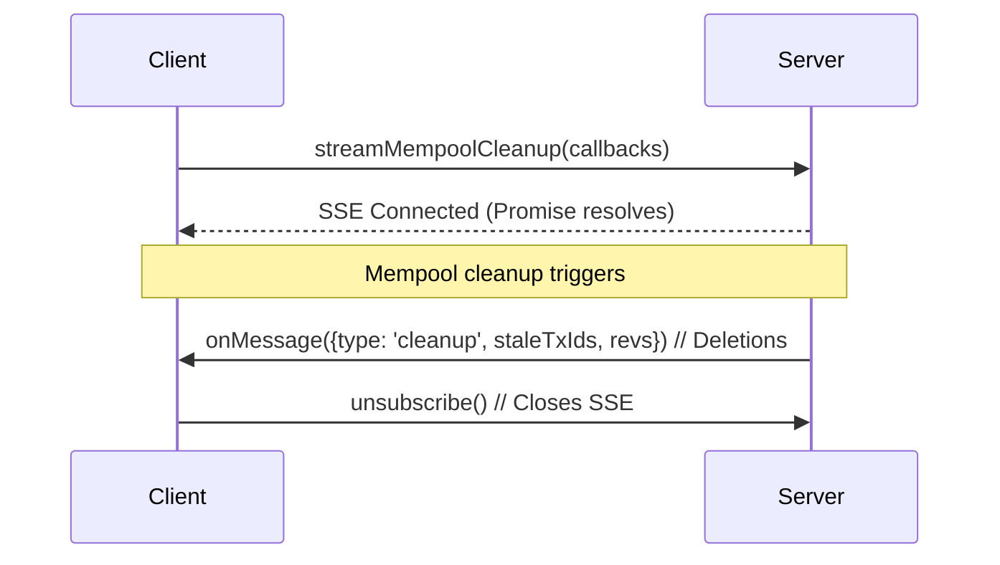

# streamMempoolCleanup

Subscribe to real-time mempool cleanup events. Get notified when the node removes stale unconfirmed transactions from its database, allowing apps to refresh or reload components for consistency. Powered by SSE for low-latency global notifications.



## Type

```ts
streamMempoolCleanup(
  onMessage: (event: { revs: string[] }) => void,
  onError?: (error: Event) => void,
): Promise<() => void>
```

### Parameters

#### `onMessage`

The function to call when a mempool cleanup event occurs. The callback receives an object containing:

- `revs`: Array of revisions (e.g., <txId>:<outputIndex>) affected by the cleanup.


#### `onError` (optional)

A callback invoked when an error occurs on the SSE connection, such as network interruptions or parsing failures. It receives a standard browser [`Event`](https://developer.mozilla.org/en-US/docs/Web/API/Event) object (e.g., with `type: 'error'` for connection issues).

For reconnection strategies, consider exponential backoff in your handler. See the [MDN SSE error handling guide](https://developer.mozilla.org/en-US/docs/Web/API/Server-sent_events/Using_server-sent_events#handling_errors) for more details.

### Return Value

A promise that resolves to a cleanup function once the SSE connection is established. Calling the function closes the connection and stops updates.

## Description

The `streamMempoolCleanup` method enables real-time notifications via Server-Sent Events (SSEs) for mempool cleanups. It opens a global SSE connection to the server and invokes the provided callback whenever the node performs a cleanup, removing stale unconfirmed transactions (those in the DB but not in the current mempool).


## Tips
- **Reconnection:** SSEs can drop on network hiccups—use `onError` for exponential backoff retries.
- **Global Scope**: No filters; receives all cleanup events—ideal for app-wide refreshes.
- **Performance:** Limit concurrent streams; each opens a dedicated SSE.
- **Cleanup Best Practice:** Always invoke the returned function in hooks like React's `useEffect` return.

