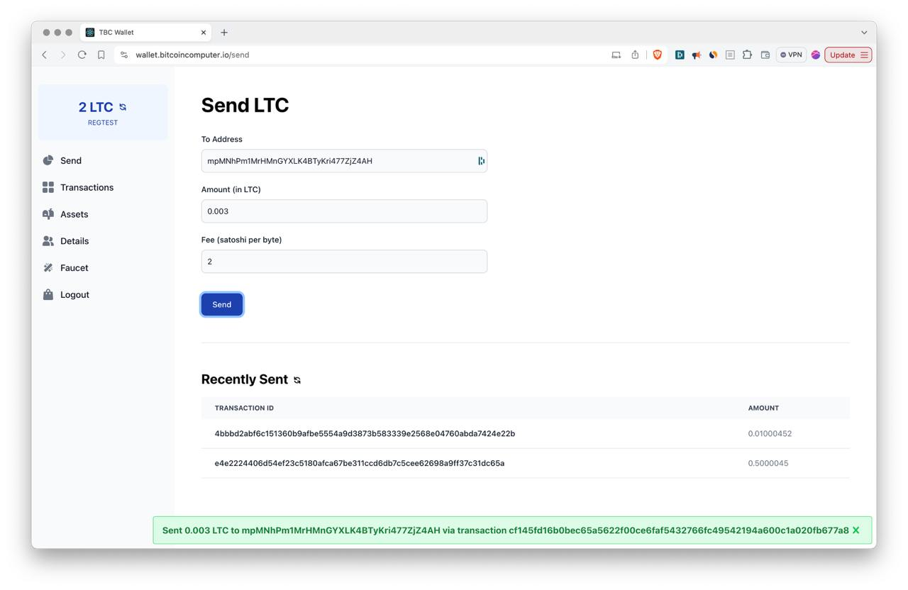
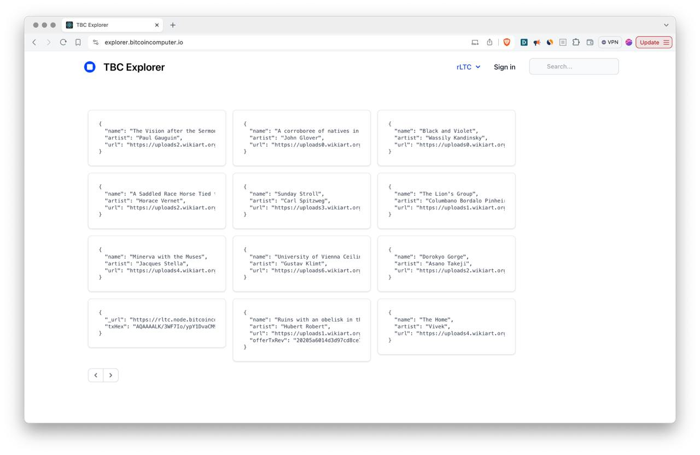
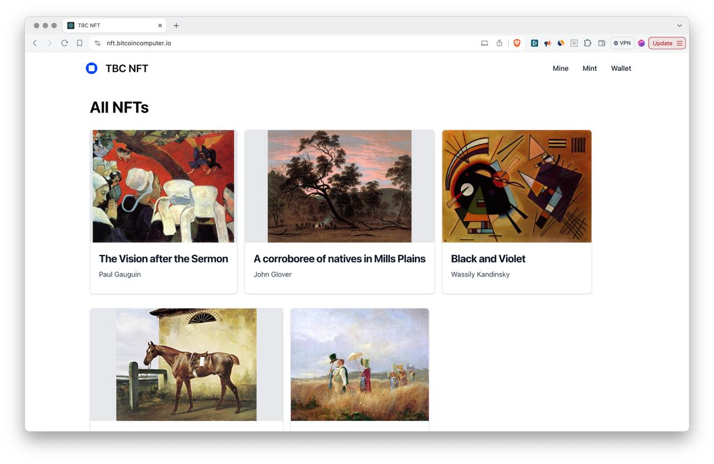

# Apps

The following are examples of open source applications builded with the Bitcoin Computer. They are all published under MIT licence so you can clone, copy, modify, contribute or use them as a starting point for you project.

## Wallet

Non custodial, open source wallet for Bitcoin and Litecoin. You can send cryptocurrency to a friend and see your balance, and the transactions sent and received.

## Explorer

Bitcoin Computer Explorer. You can explore all objects created, or log in to update your smart objects using the UI. Use the playground to create any smart contract you can imagine!

## Non Fungible Token

You can mint an NFT and trustless list it for sale. You also can see your own NFTs or buy any NFT listed.

