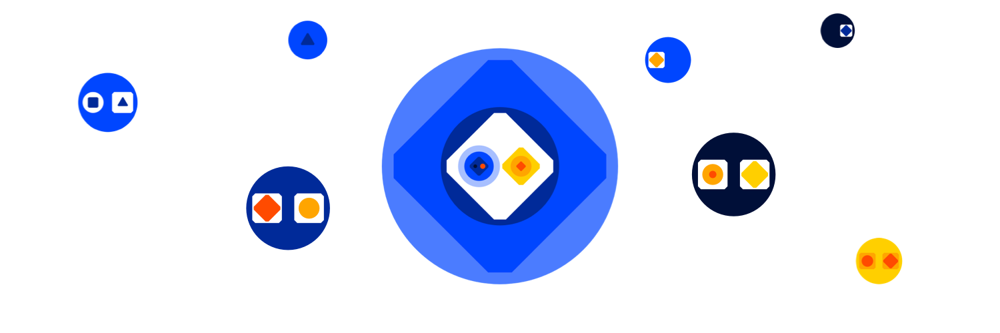

# Bitcoin Computer

### A Turing-Complete Metaprotocol for UTXO-Based Blockchains

_The Bitcoin Computer is a protocol for building applications that are as secure and decentralized as Bitcoin is. You can build games, tokens, exchanges and more without relying on a sidechain, an extra token, or a trusted third party._

**Free Computation** - Smart contracts are executed on the client. Execution costs are fixed and independent of the number of computational steps.

**Multicoin**. Deploy on Bitcoin, Litecoin, Dogecoin, Pepecoin and Groestlcoin (Bitcoin Cash coming soon) using the same code.

**JavaScript & Typescript** - Build decentralized applications that integrate seamlessly into web applications using your favorite tools and execute on high performance JavaScript engines.

**Simple** - Deploy a smart contract by inscribing a JavaScript class, create an on-chain object by inscribing a constructor call and update an on-chain object by inscribing a function call.

**Expressive** - All computable updates can be expressed and on-chain objects can be freely combined, enabling complex applications like decentralized exchanges or multi-asset games.

**Efficient** - The system is perfectly sharded, so users only need to compute values of on-chain objects they are interested in.

**Fast** - Built-in optimizations eliminate redundant computation and communication, ensuring high-performance out of the box.

**History** - Every historical state is recoverable and each update is stored in a timestamped, digitally signed transaction.

**Data Ownership** - On-chain objects are stored in UTXOs, meaning only the UTXO owner can update their state. Data ownership is as secure as cryptocurrency ownership.

**Compatible** - Compatible with existing Bitcoin protocols. You can build apps for Ordinals and Runes, or use BitVM to enforce complex data ownership rules.

**Privacy** - Public by default, built-in support for encryption and off-chain storage enables CCPA- and GDPR-compliant applications.

---

The Bitcoin Computer is developed by BCDB Inc. Join our community on [Telegram](https://t.me/thebitcoincomputer) or on [X](https://twitter.com/TheBitcoinToken).
