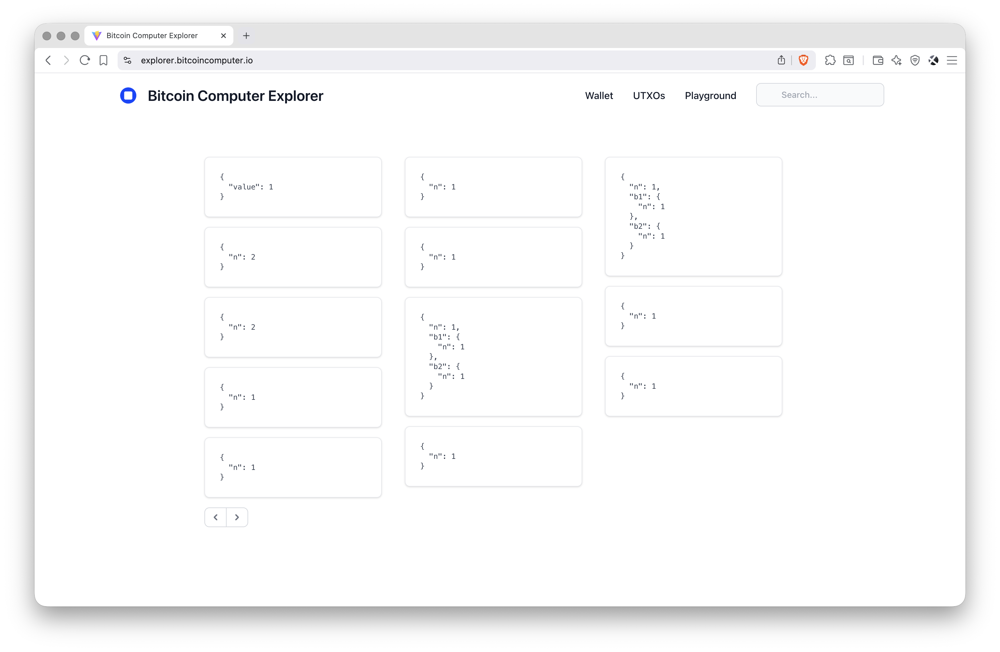

<div align="center">
  
  <h1>Bitcoin Computer Explorer</h1>
  <p>
    A Web Application for Exploring and Interacting with Smart Contracts
    <br />
    <a href="http://explorer.bitcoincomputer.io/">demo</a> &#183; <a href="http://bitcoincomputer.io/">website</a> &#183; <a href="http://docs.bitcoincomputer.io/">docs</a>
  </p>
</div>

## Demo

[http://explorer.bitcoincomputer.io/](http://explorer.bitcoincomputer.io/)

## Prerequisites

You need to have [git](https://www.git-scm.com/) and [node.js](https://nodejs.org/) installed.

## Installation

Follow the instructions below to install the [Bitcoin Computer Monorepo](https://github.com/bitcoin-computer/monorepo).

<font size=1>

```sh
# Download the monorepo
git clone https://github.com/bitcoin-computer/monorepo.git

# Move into monorepo folder
cd monorepo

# Install the dependencies
npm install

# Move to the explorer package
cd packages/explorer
```

</font>

## Usage

### Start the Application Connecting to a Remote Node

Run the commands below and open [http://localhost:1032](http://localhost:1032).

<font size=1>

```bash
# Create a .env file
cp .env.remote.example .env

# Start the app
npm run start
```

</font>

### Start the Application Connecting to a Local Node

You need to have a [Bitcoin Computer Node](https://github.com/bitcoin-computer/monorepo/tree/main/packages/node#readme) installed and running. Then run the commands below and open [http://localhost:1032](http://localhost:1032).

<font size=1>

```bash
# Create a .env file
cp .env.local.example .env

# Start the app
npm run start
```

</font>

### Fund the Wallet

See [here](https://github.com/bitcoin-computer/monorepo/tree/main/packages/node#fund-the-wallet).

### Configuration

To change the configuration please edit the `.env` file.

<font size=1>

```bash
# Application configuration
VITE_URL=https://rltc.node.bitcoincomputer.io
VITE_CHAIN=LTC
VITE_NETWORK=regtest

# Application Port
VITE_PORT=1032
```

</font>

## Documentation

Have a look at the [documentation](https://docs.bitcoincomputer.io/).

## Getting Help

If you have any questions, please let us know on <a href="https://t.me/thebitcoincomputer" target="_blank">Telegram</a>, <a href="https://twitter.com/TheBitcoinToken" target="_blank">Twitter</a>, or by email clemens@bitcoincomputer.io.

## Contributing

Contributions are most welcome! If you have found a bug or have an idea for an improvement please create an [issue](https://github.com/bitcoin-computer/monorepo/issues) or a [pull request](https://github.com/bitcoin-computer/monorepo/pulls).

## Development Status

See [here](https://github.com/bitcoin-computer/monorepo/tree/main/packages/lib#development-status).

## License

This software is licensed under the MIT License. See the [LICENSE.md](./LICENSE.md) file.

This software includes patented technology that requires payment for use on mainnet or production environments. Please review the [LEGAL.md](./LEGAL.md) file for details on patent usage and payment requirements.
