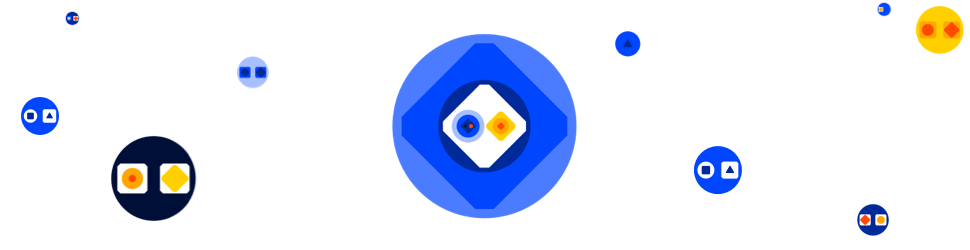

<div align="center">
  
  <h1>Bitcoin Computer Library</h1>
  <p>
    A JavaScript library for smart contracts on Bitcoin and Litecoin<br />
    <a href="http://bitcoincomputer.io/">website</a> &#183; <a href="http://docs.bitcoincomputer.io/">docs</a>
  </p>
</div>

The Bitcoin Computer is a protocol for general purpose smart contracts on Bitcoin and Litecoin. It does not rely on a separate token, a separate blockchain or any trusted intermediaries. It works similar to ordinals, runes, and BRC20: you can build applications where users add metadata to a transaction to encode a smart contract interaction, such as minting a token. The software can parse the metadata back into smart contract data, for example which users owns how many tokens.

Our metadata format consists mostly of JavaScript expressions to define the state updates. This makes it possible to build not just tokens but all applications directly on Bitcoin.

## Use in a Browser

Create a file `index.html` and open it in your browser.

<font size=1>

```html
<html>
  <head>
    <script type="module">
      // Import the library
      import {
        Computer,
        Contract,
      } from 'https://unpkg.com/@bitcoin-computer/lib/dist/bc-lib.browser.min.mjs'

      // Create a smart contract
      class Counter extends Contract {
        constructor() {
          super({ n: 0 })
        }

        inc() {
          this.n += 1
        }
      }

      // Create a wallet and fund it
      const computer = new Computer()
      await computer.faucet(1e5)

      // Mint a smart object
      const counter = await computer.new(Counter)
      document.getElementById('count').innerHTML = counter.n

      // Update smart object
      await counter.inc()
      document.getElementById('count').innerHTML = counter.n
    </script>
  </head>

  <body>
    Count: <span id="count">*</span>
  </body>
</html>
```

</font>

You should see `Count: *` at first, then `Count: 0` and then `Count: 1`.

## Use with Node.js

You need to have [node.js](https://nodejs.org/en/) installed. First install the Bitcoin Computer library.

<font size=1>

```bash
npm install @bitcoin-computer/lib
```

</font>

Then create a file `index.mjs` containing a script that defines a `Counter` smart contract, mints a `Counter` object and the updates it.

<font size=1>

```js
import { Computer, Contract } from '@bitcoin-computer/lib'

// A smart contract
class Counter extends Contract {
  constructor() {
    super({ n: 0 })
  }

  inc() {
    this.n += 1
  }
}

// Create a wallet
const computer = new Computer()

// Fund the wallet
await computer.faucet(1e5)

// Create a smart object
const counter = await computer.new(Counter)

// Update the smart object
await counter.inc()

// Log the smart object
console.log(counter)
```

</font>

Execute the script.

<font size=1>

```bash
node index.mjs
```

</font>

The expected output is:

<font size=1>

```js
Counter {
  n: 1,
  _id: '656...024:0',
  _rev: '90f...73f:0',
  _root: '656...024:0',
  _satoshis: 7860,
  _owners: ['037...954']
}
```

</font>

## Run Your Own Node

By default, an instance of the `Computer` class will connect to a Bitcoin Computer Node on regtest LTC at `https://rltc.node.bitcoincomputer.io`. You can run your own Bitcoin Computer node, see [here](https://github.com/bitcoin-computer/monorepo/tree/main/packages/node#readme) for instructions.

To connect to your node, set the `url` parameter as shown below (see [here](https://docs.bitcoincomputer.io/lib/constructor/) for more configuration options). Make sure that the parameters `chain` and `network` match your node's configuration.

<font size=1>

```js
// Connect Bitcoin Computer wallet to a Bitcoin Computer node url
const computer = new Computer({
  url: 'http://localhost:1031',
  chain: 'LTC',
  network: 'regtest',
})
```

</font>

## Api

### Constructor

Creates a new client side wallet. You can pass a mnemonic as well a chain and network to the constructor as well as other optional parameters.

```ts
const computer = new Computer({
  chain: 'LTC'
  network: 'mainnet',
  mnemonic: 'replace this seed'
  addressType: 'p2wpkh',
  path: "m/44'/0'/0'/0",
  url: 'https://my-ltc-node.com',
  satPerByte: 1
})
```

### New

Creates a smart object from a class and arguments to the constructor. An output of a Bitcoin transaction, that is inscribed with the constructor call, represents the smart object. The transaction id and output number is the id of the smart object.

A smart object can be updated through function calls. Function calls are also recorded in transactions. The new state of the object is represented by an output of this transaction that is inscribed with the function call. This output is the revision of a smart object.

```ts
class A extends Contract {
  constructor(n) {
    this.n = n
  }
}
const a = await computer.new(A, [1])
expect(a).to.deep.equal({
  n: 1,
  _id: '667c...2357:0',
  _rev: '667c...2357:0',
  _root: '667c...2357:0',
  _owners: [computer.getPublicKey()],
  _satoshis: 5820,
})
```

### Sync

Compute the value of a smart object given its revision.

```ts
const synced = await computer.sync(a._rev)
expect(synced).to.deep.equal(a)
```

### Deploy

Deploys a JavaScript module to Bitcoin. The module is inscribed in a Bitcoin transaction and the transaction id is the module specifier.

```ts
const revA = await computer.deploy(`export class A {}`)

const revB = await computer.deploy(`
  import { A } from '${revA}'
  export class B extends A {}
`)
```

### Load

Loads a JavaScript module from the blockchain given a modules specifier.

```ts
class A {}
const rev = await computer.deploy(`export ${A}`)
const { A: Loaded } = await computer.load(rev)
expect(Loaded).to.equal(A)
```

### Encode

Inputs a JavaScript expression, possibly a module specifier, and possibly a "blockchain environment" that maps the (free) variables of the expression to utxos. The expression is evaluated in the scope of the module, substituting the (free) variables for the values computed for the respective utxo. A transaction is broadcast that spends the utxos, has one output for each object in the new state, and is inscribed with the expression, the module specifier and the blockchain environment. Returns the changed state after the evaluation and a transaction.

```ts
const { effect, tx } = await computer.encode({ exp: `${A} new A()` })
```

### Decode

Inputs a revision (transaction id and output number) and returns a JavaScript expression, a module specifier, and a blockchain environment, if present.

```ts
const decoded = await computer.decode(tx)
expect(decoded).to.deep.equal({ exp: `${A} new A()` })
```

### Query

Finds smart objects by module specifier or by owner. Also finds the latest revision of a smart object.

```ts
const revs = await computer.query({ publicKey })
expect(revs).eq(/* all revisions owned by publicKey */)
```

### Faucet

Fund a client side library object on regtest. This is practical for testing.

```ts
await computer.faucet(0.001e8)
```

### RPC

Access the RPC interface of the Bitcoin node

```ts
await computer.rpcCall('getBlockchainInfo', '')
```

### Wallet Functionality

- _sign_. Signs a Bitcoin transaction
- _broadcast_. Broadcasts a Bitcoin transaction
- _send_. Sends satoshis to an address
- _getAddress_. Returns the Bitcoin address of the computer wallet
- _getBalance_. Returns the balance in satoshi

## Documentation

Have a look at the [docs](https://docs.bitcoincomputer.io/).

## Getting Help

If you have any questions, please let us know on <a href="https://t.me/thebitcoincomputer" target="_blank">Telegram</a>, <a href="https://twitter.com/TheBitcoinToken" target="_blank">Twitter</a>, or by email clemens@bitcoincomputer.io.

## Price

The Bitcoin Computer is, and will always be, free on testnet and regtest. This version of the Bitcoin Computer library is also free on mainnet, but we reserve the right to charge a small amount per transaction in future versions. Currently only miner fees apply.

## Development Status

We are in beta, so there is a possibility of bugs.

## Legal Notice

_Sanctioned Users are Prohibited_. You may not access or use software developed and published by us if you are (i) a resident of any country with which transactions or dealings are prohibited by governmental sanctions imposed by the U.S., the United Nations, the European Union, the United Kingdom, or any other applicable jurisdiction (collectively, “Sanctions Regimes”); (ii) a person, entity or government prohibited under an applicable Sanctions Regime (“Sanctioned Person”), including the Office of Foreign Assets Control, Specially Designated Nationals and Blocked Persons List; or (iii) prohibited from accessing or using the Software pursuant to the laws, rules, and regulations in the jurisdiction in which you reside or otherwise access and use the Software.

_Users Must Comply with Applicable Law_. You may only access or use the Software in compliance with laws, rules, and regulations in the jurisdiction in which you reside or otherwise access and use the Software, including, as applicable, Sanctions Regimes, anti-money laundering laws and regulations, and securities laws and regulations.

_BCDB Does Not Endorse or Promote User Software Activity_. We are publishing certain portions of the Software, on an open-source basis, to demonstrate the utility of the Bitcoin Computer. As this Software is open-source, it may be modified and deployed for a wide range of uses that we may not have intended. We do not endorse or promote, and expressly disclaim liability for, any non-BCDB use or modification of the Software.

## License

This software is licensed under the [Creative Commons Attribution-NoDerivs 3.0 Unported](https://creativecommons.org/licenses/by-nd/3.0/) license.

You are free to: share, copy, and redistribute the material in any medium or format for any purpose, even commercially under the following terms:

- Attribution — You must give appropriate credit, provide a link to the license, and indicate if changes were made. You may do so in any reasonable manner, but not in any way that suggests the licensor endorses you or your use.
- NoDerivatives — If you remix, transform, or build upon the material, you may not distribute the modified material.

This is a human-readable summary of (and not a substitute for) the [license](https://creativecommons.org/licenses/by-nd/3.0/legalcode).
