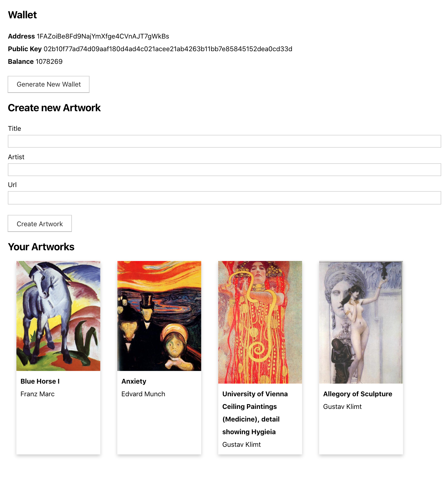

# Non-Fungible Token Application

A minimal application for creating and sharing tokens. You can create a new artwork token and send it to a friend. The screen refreshes every few seconds to show the tokens owned by each user. Build using [Bitcoin Computer](https://bitcoin-computer.gitbook.io/docs/).




The application first creates a ```Computer``` object. You can configure the parameters to use <em>regtest</em> (local) or <em>testnet</em> network modes. You can use a set of [BIP39 words] (https://iancoleman.io/bip39/) as seed.


```javascript
const [config] = useState({
    chain: 'LTC',
    network: 'testnet',
    url: 'https://node.bitcoincomputer.io',
    // to run locally, change network and url:
    // network: 'regtest',
    // url: 'http://127.0.0.1:3000',
  });
  const [computer, setComputer] = useState(
    new Computer({
      ...config,
      seed: 'travel upgrade inside soda birth essence junk merit never twenty system opinion'
    })
  );
```

We are currently supporting LTC, and will add support to other currencies soon. You can make a deposit into the wallet by sending Litecoins to the address shown, using [this](https://testnet-faucet.com/ltc-testnet/) or [this LTC faucet](http://litecointf.salmen.website/).

You can find more information in the [docs](https://bitcoin-computer.gitbook.io/docs/). Also check out the corresponding [Youtube tutorial](https://www.youtube.com/watch?v=SnTwevzmRrs).

<a href="http://www.youtube.com/watch?feature=player_embedded&v=SnTwevzmRrs
" target="_blank"></a>

# MIT License

Copyright (c) 2022 BCDB Inc.

Permission is hereby granted, free of charge, to any person obtaining a copy of this software and associated documentation files (the "Software"), to deal in the Software without restriction, including without limitation the rights to use, copy, modify, merge, publish, distribute, sublicense, and/or sell copies of the Software, and to permit persons to whom the Software is furnished to do so, subject to the following conditions:

The above copyright notice and this permission notice shall be included in all copies or substantial portions of the Software.

THE SOFTWARE IS PROVIDED "AS IS", WITHOUT WARRANTY OF ANY KIND, EXPRESS OR IMPLIED, INCLUDING BUT NOT LIMITED TO THE WARRANTIES OF MERCHANTABILITY, FITNESS FOR A PARTICULAR PURPOSE AND NONINFRINGEMENT. IN NO EVENT SHALL THE AUTHORS OR COPYRIGHT HOLDERS BE LIABLE FOR ANY CLAIM, DAMAGES OR OTHER LIABILITY, WHETHER IN AN ACTION OF CONTRACT, TORT OR OTHERWISE, ARISING FROM, OUT OF OR IN CONNECTION WITH THE SOFTWARE OR THE USE OR OTHER DEALINGS IN THE SOFTWARE.
