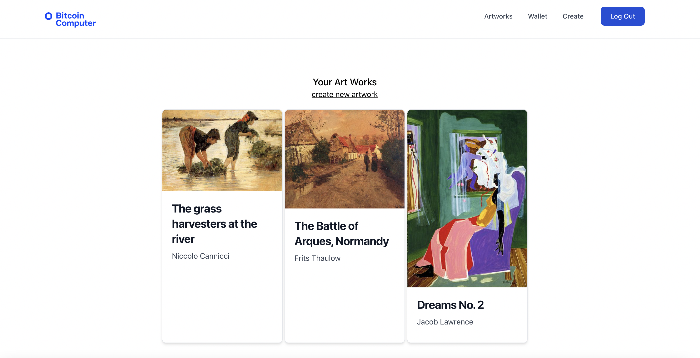

# Non-Fungible Token Application

An application for creating, storing and sending non-fungible tokens on Litecoin. Built using the [Bitcoin Computer](https://bitcoin-computer.gitbook.io/docs/).

## Get Started

To run the application on testnet use the following commands. The application will connect to a [Bitcoin Computer Node](https://github.com/bitcoin-computer/monorepo/tree/main/packages/node#bitcoin-computer-node) provided by BCDB Inc.

````
yarn install
yarn start
````

## Run With Your Own Node

To run your own node, follow the instructions the [here](https://github.com/bitcoin-computer/monorepo/tree/main/packages/node#getting-started). Then change the file [App.js](https://github.com/bitcoin-computer/monorepo/blob/main/packages/non-fungible-token/src/App.js) as shown below.

```javascript
function App() {
  const [config] = useState({
    chain: "LTC",
    ...getConf("regtest")   // <-- change this line to "testnet"
  })
  ...
```

## Troubleshooting

If you get an error ``"Insuficient balance in address <your address>"``, take a look to the Bitcoin Computer Node [documentation](https://github.com/bitcoin-computer/monorepo/tree/main/packages/node#fund-the-wallet) for how to fund your wallet.


## Screenshots



## Video

<a href="http://www.youtube.com/watch?feature=player_embedded&v=SnTwevzmRrs
" target="_blank"></a>

# MIT License

Copyright (c) 2022 BCDB Inc.

Permission is hereby granted, free of charge, to any person obtaining a copy of this software and associated documentation files (the "Software"), to deal in the Software without restriction, including without limitation the rights to use, copy, modify, merge, publish, distribute, sublicense, and/or sell copies of the Software, and to permit persons to whom the Software is furnished to do so, subject to the following conditions:

The above copyright notice and this permission notice shall be included in all copies or substantial portions of the Software.

THE SOFTWARE IS PROVIDED "AS IS", WITHOUT WARRANTY OF ANY KIND, EXPRESS OR IMPLIED, INCLUDING BUT NOT LIMITED TO THE WARRANTIES OF MERCHANTABILITY, FITNESS FOR A PARTICULAR PURPOSE AND NONINFRINGEMENT. IN NO EVENT SHALL THE AUTHORS OR COPYRIGHT HOLDERS BE LIABLE FOR ANY CLAIM, DAMAGES OR OTHER LIABILITY, WHETHER IN AN ACTION OF CONTRACT, TORT OR OTHERWISE, ARISING FROM, OUT OF OR IN CONNECTION WITH THE SOFTWARE OR THE USE OR OTHER DEALINGS IN THE SOFTWARE.
